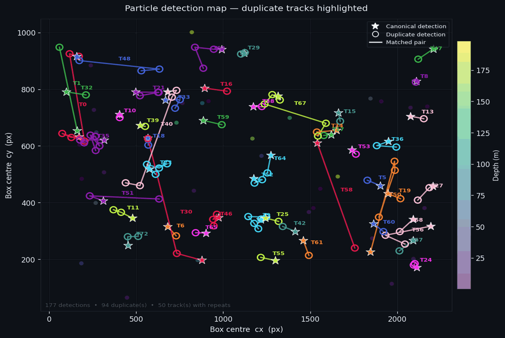

# trackdedup
[](https://github.com/semantic-release/semantic-release)

Hungarian-algorithm de-duplication of in-situ particle detections in Planktivore data.

The same physical particle can appear in multiple images during a single
imaging burst (detector overlap) or across successive bursts as the camera
platform moves. `trackdedup` identifies those repeat detections and groups
them into a single canonical track, so downstream analyses count each
particle only once.



---

## How it works

CSV detections take box position and timestamp from the image filename, and
depth from `localizations.csv`. CFE lab parquet files already carry
`filename`, `epoch_seconds` (camera time in microseconds), `time`, and
`depth`. Pass `--base-path` to join that directory onto each relative
`filename` and store the full image path.

Box position is still parsed from the filename:

```
low_mag_cam-{timestamp_us}-{session}-{frame}-{roi_idx}-{x}-{y}-{w}-{h}_rawcolor.jpg
```

The box center `(cx, cy)` is computed as `(x + w/2, y + h/2)`.
Depth and label information come from an accompanying `localizations.csv`.

Matching runs in two passes using `scipy.spatial.distance.cdist` and
`scipy.optimize.linear_sum_assignment`:

| Pass | Scope | Method |
|------|-------|--------|
| 1 — within-burst | Detections in the same imaging burst (< `--frame-gap` s apart) | Exhaustive pairwise distance |
| 2 — cross-burst | Burst pairs whose midpoints are within `--time-gate` s | Hungarian (globally optimal bijective matching) |

Both passes work in a normalised feature space `[cx/σ_xy, cy/σ_xy, depth/σ_depth]`
and accept matches whose Euclidean distance is ≤ `--max-cost`.
A Union-Find structure propagates track identity through all accepted matches,
so a particle seen three or more times is grouped into a single track.

The output CSV adds four columns to the input:

| Column | Description |
|--------|-------------|
| `track_id` | Integer ID shared by all detections of the same particle |
| `canonical_uuid` | UUID of the first-seen detection in the track |
| `is_duplicate` | `True` for every detection that is not the canonical one |
| `frame_id` | Imaging-burst index (detections with the same `frame_id` are < `--frame-gap` s apart) |

---

## Full example

From the repository root (`planktivore-trackdedup/`):

```bash
# 1. Extract the sample dataset
cd data
tar -zxf data.tar.gz
cd ..

# This creates data/ptvr_lm/ with:
#   localizations.csv          — input detections
#   crops/Velella_velella/     — crop images keyed by UUID
#   images/                    — full-frame images

# 2. Create and activate a virtual environment
python3 -m venv .venv
source .venv/bin/activate        # Windows: .venv\Scripts\activate

# 3. Install dependencies
pip install numpy pandas scipy Pillow matplotlib pyarrow

# 4. Run de-duplication
python src/hungarian_dedup.py data/ptvr_lm/localizations.csv \
    -o data/ptvr_lm/localizations_dedup.csv \
    --verbose

# 5. Generate the animated GIF
python src/visualize_dedup.py \
    --dedup data/ptvr_lm/localizations_dedup.csv \
    --crops data/ptvr_lm/crops/Velella_velella \
    --out docs/imgs/dedup_visualization.gif
```

Expected output from step 4 (default thresholds):

```
177 detections → 89 unique track(s)
 88 duplicate(s) identified (49.7%)
```

The GIF written in step 5 is the same animation shown at the top of this README.

---

## CFE lab parquet example

`data/April_20_2026_lowmag_level2_with_depth_time_with_depth_time_tiny.parquet`
is a 200-detection sample from the April 20 2026 Ahi deployment with columns
`filename`, `epoch_seconds`, `time`, `depth`, and the `dinov3_v32_v3` label and
score. `filename` is relative to the low-mag camera directory, so pass
`--base-path` to store the full image path.

The low-mag camera runs at about 10 Hz, so frames are ~0.1 s apart. The CSV
defaults (`--frame-gap 2.0`, `--time-gate 600`) would put all 60 camera frames
in one burst and merge every detection into a single track. Use one burst per
camera frame, compare only nearby frames, and a tighter spatial scale:

```bash
python src/hungarian_dedup.py \
    data/April_20_2026_lowmag_level2_with_depth_time_with_depth_time_tiny.parquet \
    --base-path /Volumes/DeepSea-AI/data/Planktivore/raw/2026_April_20_Ahi-Planktivore/low_mag_cam/ \
    --frame-gap 0.05 \
    --time-gate 0.25 \
    --sigma-xy 20 \
    -o data/April_20_2026_lowmag_level2_with_depth_time_with_depth_time_tiny_dedup.parquet \
    --verbose
```

On Linux the share is usually mounted at `/mnt/DeepSea-AI/...`. Output is
written as parquet when `-o` ends in `.parquet`, otherwise CSV.

Expected output:

```
200 detections → 199 unique track(s)
  1 duplicate(s) identified (0.5%)
```

Visualise the result. Each ROI image is its own crop, located at
`--base-path` / `filename`:

```bash
python src/visualize_dedup.py \
    --dedup data/April_20_2026_lowmag_level2_with_depth_time_with_depth_time_tiny_dedup.parquet \
    --base-path /Volumes/DeepSea-AI/data/Planktivore/raw/2026_April_20_Ahi-Planktivore/low_mag_cam/ \
    --out data/April_20_2026_lowmag_dedup.gif
```

---

## Usage

```bash
python src/hungarian_dedup.py data/ptvr_lm/localizations.csv \
    -o data/ptvr_lm/localizations_dedup.csv

# Tune matching thresholds:
python src/hungarian_dedup.py data/ptvr_lm/localizations.csv \
    --sigma-xy 300 \
    --sigma-depth 5 \
    --max-cost 1.5 \
    --frame-gap 2.0 \
    --time-gate 600

# Visualise results:
python src/visualize_dedup.py \
    --dedup data/ptvr_lm/localizations_dedup.csv \
    --crops data/ptvr_lm/crops/Velella_velella \
    --out docs/imgs/dedup_visualization.gif
```

## Dependencies

```
numpy
pandas
scipy
Pillow
matplotlib
pyarrow
```
 
## AI Disclosure

This project was developed with the assistance of AI tools, including Claude and Cursor. 
AI was used for code generation, refactoring, and documentation assistance.
